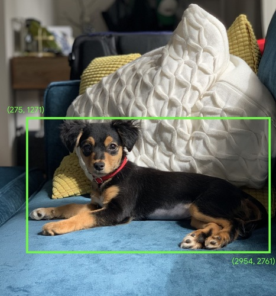
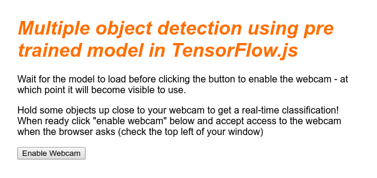
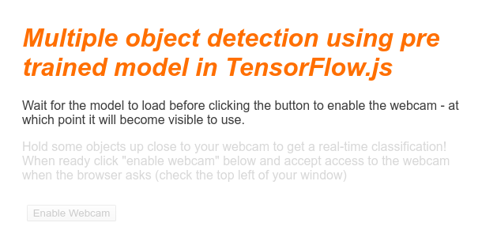
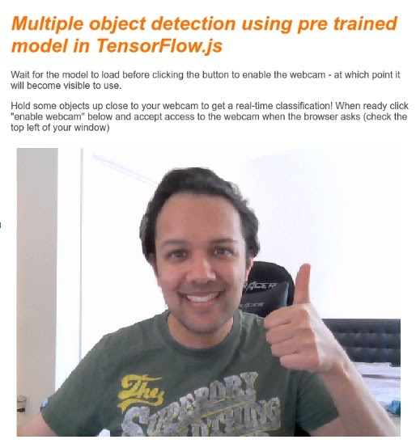
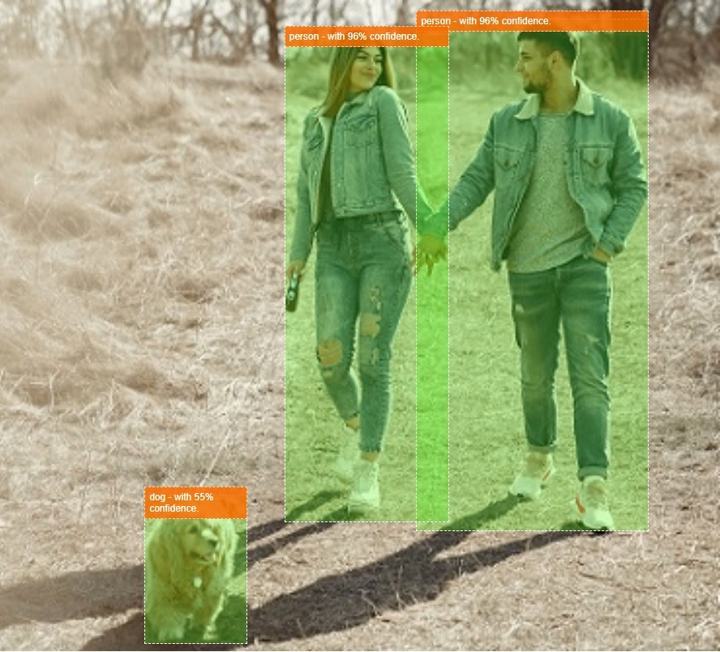

# [Codelab] Make a smart webcam in JavaScript with a TensorFlow.js pre-trained Machine Learning model

> **Note**: Information can be found [here](https://codelabs.developers.google.com/codelabs/tensorflowjs-object-detection#0).
>
> While Google could remove instructions, I copy/paste them below.

## About this codelab
Written by Jadon Mayes

## 1. Before you begin

Machine Learning is quite the buzzword these days. It's applications appear to be without limit, and it seems poised to 
touch almost every industry in the near future. If you work as an engineer or designer, front end or back end, and you're 
familiar with JavaScript, this codelab was written to help you get started adding Machine Learning to your skillset.

### Prerequisites
This codelab was written for experienced engineers already familiar with JavaScript.

### What you'll build
In this codelab, you'll

- Create a webpage that uses machine learning directly in the web browser via TensorFlow.js to classify and detect common 
objects, (yes, including more than one at a time), from a live webcam stream.
- Supercharge your regular webcam to identify objects and get the coordinates of the bounding box for each object it finds
- Highlight the found object in the video stream, as shown below:


Imagine being able to detect if a person was in a video, so you could then count how many people were present at any given 
time to estimate how busy a certain area was over the day, or send yourself an alert when your dog was detected in a room 
of your house whilst you are away that maybe it should not be in. If you could do that you would be well on your way to 
making your own version of a [Google Nest cam](https://store.google.com/us/product/nest_cam) that could alert you when it sees an intruder (of any type) using your own 
custom hardware! Pretty neat. Is it hard to do? Nope. Let's get hacking...

### What you'll learn
- How to load a pre-trained TensorFlow.js model.
- How to grab data from a live webcam stream and draw it to canvas.
- How to classify an image frame to find the bounding box(s) of any object(s) the model has been trained to recognize.
- How to use the data passed back from the model to highlight found objects.

This codelab is focuses on how to get started using TensorFlow.js pre-trained models. Concepts and code blocks that are 
not relevant to TensorFlow.js and machine learning are not explained, and are provided for you to simply copy and paste.

## 2. What is TensorFlow.js?

[TensorFlow.js](https://www.tensorflow.org/js) is an [open source machine learning library](https://github.com/tensorflow/tfjs)
that can run anywhere JavaScript can. It's based upon the [original TensorFlow library written in Python](https://www.tensorflow.org/)
and aims to re-create this developer experience and set of APIs for the JavaScript ecosystem.

### Where can it be used?
Given the portability of JavaScript, you can now write in 1 language and perform machine learning across all of the following platforms with ease:

- **Client side in the web browser** using vanilla JavaScript
- **Server side and even IoT devices like Raspberry Pi** using Node.js
- **Desktop apps** using Electron
- **Native mobile apps** using React Native

TensorFlow.js also supports multiple backends within each of these environments (the actual hardware based environments 
it can execute within such as the CPU or WebGL for example. A "backend" in this context does not mean a server side 
environment - the backend for execution could be client side in WebGL for example) to ensure compatibility and also keep
things running fast. Currently TensorFlow.js supports:

- **WebGL execution on the device's graphics card** (GPU) - this is the fastest way to execute larger models (over 3MB in size) with GPU acceleration.
- **Web Assembly (WASM) execution on CPU** - to improve CPU performance across devices including older generation mobile 
phones for example. This is better suited to smaller models (less than 3MB in size) which can actually execute faster on 
CPU with WASM than with WebGL due to the overhead of uploading content to a graphics processor.
- **CPU execution** - the fallback should none of the other environments be available. This is the slowest of the three but is always there for you.

> Note: You can choose to force one of these backends if you know what device you will be executing on, or you can simply 
let TensorFlow.js decide for you if you do not specify this.

### Client side super powers
Running TensorFlow.js in the web browser on the client machine can lead to several benefits that are worth considering.

#### Privacy
You can both train and classify data on the client machine without ever sending data to a 3rd party web server. 
There may be times where this may be a requirement to comply with local laws, such as GDPR for example, or when processing 
any data that the user may want to keep on their machine and not sent to a 3rd party.

#### Speed
As you are not having to send data to a remote server, inference (the act of classifying the data) can be faster. 
Even better, you have direct access to the device's sensors such as the camera, microphone, GPS, accelerometer and more 
should the user grant you access.

#### Reach and scale
With one click anyone in the world can click a link you send them, open the web page in their browser, and utilise what 
you have made. No need for a complex server side Linux setup with CUDA drivers and much more just to use the machine learning system.

#### Cost
No servers means the only thing you need to pay for is a CDN to host your HTML, CSS, JS, and model files. The cost of a 
CDN is much cheaper than keeping a server (potentially with a graphics card attached) running 24/7.

### Server side features
Leveraging the Node.js implementation of TensorFlow.js enables the following features.

#### Full CUDA support
On the server side, for graphics card acceleration, you must install the [NVIDIA CUDA drivers](https://developer.nvidia.com/cuda-zone) 
to enable TensorFlow to work with the graphics card (unlike in the browser which uses WebGL - no install needed). 
However with full CUDA support you can fully leverage the graphics card's lower level abilities, leading to faster 
training and inference times. Performance is on parity with the Python TensorFlow implementation as they both share the same C++ backend.

#### Model Size
For cutting edge models from research, you may be working with very large models, maybe gigabytes in size. These models 
can not currently be run in the web browser due to the limitations of memory usage per browser tab. To run these larger 
models you can use Node.js on your own server with the hardware specifications you require to run such a model efficiently.

#### IOT
Node.js is supported on popular single board computers like the [Raspberry Pi](https://www.raspberrypi.org/), 
which in turn means you can execute TensorFlow.js models on such devices too.

#### Speed
Node.js is written in JavaScript which means that it benefits from just in time compilation. This means that you may often
see performance gains when using Node.js as it will be optimized at runtime, especially for any preprocessing you may be doing. 
A great example of this can be seen in this [case study](https://blog.tensorflow.org/2020/05/how-hugging-face-achieved-2x-performance-boost-question-answering.html) 
which shows how Hugging Face used Node.js to get a 2x performance boost for their natural language processing model.

Now you understand the basics of TensorFlow.js, where it can run, and some of the benefits, let's start doing useful things with it!

## 3. Pre-trained models

TensorFlow.js provides a variety of pre-trained machine learning (ML) models. These models have been trained by the TensorFlow.js
team and wrapped in an easy to use class, and are a great way to take your first steps with machine learning. Instead of 
building and training a model to solve your problem, you can import a pre-trained model as your starting point.

You can find a growing list of easy to use pre-trained models on the Tensorflow.js [Models for JavaScript](https://www.tensorflow.org/js/models) 
page. There are also other places you can obtain converted TensorFlow models that work in TensorFlow.js, including 
[TensorFlow Hub](https://tfhub.dev/s?deployment-format=tfjs).

### Why would I want to use a pre-trained model?

There are a number of benefits to starting with a popular pre-trained model if it fits your desired use case, such as:

1. **Not needing to gather training data yourself**. Preparing data in the correct format, and labelling it so that a machine 
learning system can use it to learn from, can be very time consuming and costly.
2. **The ability to rapidly prototype an idea with reduced cost and time**. 
There is no point "reinventing the wheel" when a pre-trained model may be good enough to do what you need, allowing you 
to concentrate on using the knowledge provided by the model to implement your creative ideas.
3. **Use of state of the art research**. Pre-trained models are often based on popular research, giving you exposure to
such models, whilst also understanding their performance in the real world.
4. **Ease of use and extensive documentation**. Due to the popularity of such models.
5. **[Transfer learning](https://developers.google.com/machine-learning/glossary) capabilities**. Some pre-trained models 
offer transfer learning capabilities, which is essentially the practice of transferring information learnt from one machine 
learning task, to another similar example. For example, a model that was originally trained to recognize cats could be 
retrained to recognize dogs, if you gave it new training data. This will be faster since you won't be starting with a blank canvas. 
The model can use what it has already learned to recognize cats to then recognize the new thing - dogs have eyes and 
ears too after all, so if it already knows how to find those features, we are halfway there. Re-train the model on your 
own data in a much faster way.

### What is COCO-SSD?
COCO-SSD is the name of a pre-trained object detection ML model that you'll use during this codelab, which aims to localize
and identify multiple objects in a single image. In other words, it can let you know the bounding box of objects it has
been trained to find to give you the location of that object in any given image you present to it. An example is shown in the image below:



If there were more than 1 dog in the image above, you would be given the coordinates of 2 bounding boxes, describing the
location of each. COCO-SSD has been pre-trained to recognize [90 common everyday objects](https://github.com/tensorflow/tfjs-models/blob/master/coco-ssd/src/classes.ts)
, such as a person, a car, a cat, etc.

### Where did the name come from?
The name may sound strange but it originates from 2 acronyms:

- COCO: Refers to the fact it was trained on the [COCO (Common Objects in Context) dataset](http://cocodataset.org/#home)
which is freely available for anyone to download and use when training their own models. The dataset contains over 200,000
labeled images which can be used to learn from.
- SSD (Single Shot MultiBox Detection): Refers to part of the model architecture that was used in the model's implementation.
You do not need to understand this for the codelab, but if you are curious you can [learn more about SSD here](https://towardsdatascience.com/understanding-ssd-multibox-real-time-object-detection-in-deep-learning-495ef744fab).

## 4. Get set up
### What you'll need
- A modern web browser.
- Basic knowledge of HTML, CSS, JavaScript, and [Chrome DevTools](https://developer.chrome.com/devtools) (viewing the console output).

### Let's get coding
Boilerplate templates to start from have been created for Glitch.com or Codepen.io. You can simply clone either template 
as your base state for this code lab, in just one click.

On Glitch, click the remix this button to fork it and make a new set of files you can edit.

Alternatively, on Codepen, click fork in the lower bottom right of the screen.

This very simple skeleton provides you with the following files:

- HTML page (index.html)
- Stylesheet (style.css)
- File to write our JavaScript code (script.js)

For your convenience, there is an added import in the HTML file for the TensorFlow.js library. It looks like this:

#### index.html
```html
<!-- Import TensorFlow.js library -->
<script src="https://cdn.jsdelivr.net/npm/@tensorflow/tfjs/dist/tf.min.js" type="text/javascript"></script>
```

#### Alternative: Use your preferred webeditor or work locally
If you want to download the code and work locally, or on a different online editor, simply create the 3 files named above
in the same directory and copy and paste the code from our Glitch boilerplate into each of them.

> Caution: If you are running locally, instead of another site like Codepen.io or similar, ensure you are serving the files
> from a web server and not just double clicking the index.html to open using the file:// protocol.

## 5. Populate the HTML skeleton

All prototypes require some basic HTML scaffolding. You will use this to render the output of the machine learning model later.
Let's set that up now:

- A title for the page
- Some descriptive text
- A button to enable the webcam
- A video tag to render the webcam stream to

To set up these features, open index.html and paste over the existing code with the following:

#### index.html
```html
<!DOCTYPE html>
<html lang="en">
  <head>
    <title>Multiple object detection using pre trained model in TensorFlow.js</title>
    <meta charset="utf-8">
    <!-- Import the webpage's stylesheet -->
    <link rel="stylesheet" href="style.css">
  </head>  
  <body>
    <h1>Multiple object detection using pre trained model in TensorFlow.js</h1>

    <p>Wait for the model to load before clicking the button to enable the webcam - at which point it will become visible to use.</p>
    
    <section id="demos" class="invisible">

      <p>Hold some objects up close to your webcam to get a real-time classification! When ready click "enable webcam" below and accept access to the webcam when the browser asks (check the top left of your window)</p>
      
      <div id="liveView" class="camView">
        <button id="webcamButton">Enable Webcam</button>
        <video id="webcam" autoplay width="640" height="480"></video>
      </div>
    </section>

    <!-- Import TensorFlow.js library -->
    <script src="https://cdn.jsdelivr.net/npm/@tensorflow/tfjs/dist/tf.min.js" type="text/javascript"></script>
    <!-- Load the coco-ssd model to use to recognize things in images -->
    <script src="https://cdn.jsdelivr.net/npm/@tensorflow-models/coco-ssd"></script>
    
    <!-- Import the page's JavaScript to do some stuff -->
    <script src="script.js" defer></script>
  </body>
</html>
```
### Understand the code

Notice some key things you added:

- You added a `<h1>` tag and some `<p>` tags for the header and some information about how to use the page. Nothing special here.

You also added a section tag representing your demo space:

#### index.html
```html
    <section id="demos" class="invisible">

      <p>Hold some objects up close to your webcam to get a real-time classification! When ready click "enable webcam" below and accept access to the webcam when the browser asks (check the top left of your window)</p>
      
      <div id="liveView" class="webcam">
        <button id="webcamButton">Enable Webcam</button>
        <video id="webcam" autoplay width="640" height="480"></video>
      </div>
    </section>
```
- Initially, you'll give this `section` a class of "invisible". This is so you can visually illustrate to the user when 
the model is ready, and it's safe to click the **enable webcam** button.
- You added the **enable webcam** button, which you'll style in your CSS.
- You also added a video tag, to which you'll stream your webcam input. You'll set this up in your JavaScript code shortly.

If you preview the output right now, it should look something like this:



> **Tip**: You can live preview your work on Glitch.com by clicking the **show** drop-down menu at the top left of the
> screen, and selecting **next to the code**.

## 6. Add style

### Element defaults
First, let's add styles for the HTML elements we just added to ensure they render correctly:

#### style.css
```css

body {
font-family: helvetica, arial, sans-serif;
margin: 2em;
color: #3D3D3D;
}

h1 {
font-style: italic;
color: #FF6F00;
}

video {
display: block;
}

section {
opacity: 1;
transition: opacity 500ms ease-in-out;
}
```
Next, add some useful CSS classes to help with various different states of our user interface, such as when we want to 
hide the button, or make the demo area appear unavailable if the model is not ready yet.

#### style.css
```css
.removed {
display: none;
}

.invisible {
opacity: 0.2;
}

.camView {
position: relative;
float: left;
width: calc(100% - 20px);
margin: 10px;
cursor: pointer;
}

.camView p {
position: absolute;
padding: 5px;
background-color: rgba(255, 111, 0, 0.85);
color: #FFF;
border: 1px dashed rgba(255, 255, 255, 0.7);
z-index: 2;
font-size: 12px;
}

.highlighter {
background: rgba(0, 255, 0, 0.25);
border: 1px dashed #fff;
z-index: 1;
position: absolute;
}
```
Great! That's all you need. If you successfully overwrote your styles with the 2 pieces of code above, your live preview 
should now look like this:


Notice how the demo area text and the button are unavailable, as the HTML by default has the class "invisible" applied. 
You will use JavaScript to remove this class once the model is ready to be used.

## 7. Create JavaScript skeleton

> Tip: The code below is shown in order, but broken down into smaller parts for deeper explanation. If you copy and paste 
> each segment to the end of the JavaScript file each time, or replace a defined empty function from the previous step 
> as advised, everything should work just fine :-)

### Referencing key DOM elements

First, ensure you can access key parts of the page you will need to manipulate or access later on in our code:
#### script.js
```javascript
const video = document.getElementById('webcam');
const liveView = document.getElementById('liveView');
const demosSection = document.getElementById('demos');
const enableWebcamButton = document.getElementById('webcamButton');
```

### Check for webcam support
You can now add some assistive functions to check if the browser you're using supports accessing the webcam stream via `getUserMedia`:
#### script.js
```javascript
// Check if webcam access is supported.
function getUserMediaSupported() {
  return !!(navigator.mediaDevices &&
    navigator.mediaDevices.getUserMedia);
}

// If webcam supported, add event listener to button for when user
// wants to activate it to call enableCam function which we will 
// define in the next step.
if (getUserMediaSupported()) {
  enableWebcamButton.addEventListener('click', enableCam);
} else {
  console.warn('getUserMedia() is not supported by your browser');
}

// Placeholder function for next step. Paste over this in the next step.
function enableCam(event) {
}
```

### Fetching the webcam stream
Next, fill out the code for the previously empty `enableCam` function we defined above by copying and pasting the code below:

> **Caution**: Ensure you copy the code below and paste it over the enableCam function we defined in the previous step 
> instead of just adding to the end of the file.

#### script.js
```javascript
// Enable the live webcam view and start classification.
function enableCam(event) {
  // Only continue if the COCO-SSD has finished loading.
  if (!model) {
    return;
  }
  
  // Hide the button once clicked.
  event.target.classList.add('removed');  
  
  // getUsermedia parameters to force video but not audio.
  const constraints = {
    video: true
  };

  // Activate the webcam stream.
  navigator.mediaDevices.getUserMedia(constraints).then(function(stream) {
    video.srcObject = stream;
    video.addEventListener('loadeddata', predictWebcam);
  });
}
```

Finally, add some temporary code so you can test if the webcam is working.

The code below will pretend your model is loaded and enable the camera button, so you can click it. You'll replace all of
this code in the next step, so be prepared to delete it again in a moment:

#### script.js
```javascript
// Placeholder function for next step.
function predictWebcam() {
}

// Pretend model has loaded so we can try out the webcam code.
var model = true;
demosSection.classList.remove('invisible');
```

> **Try it!** At this point, if you actually run the current code as it stands and click the button once it becomes available, 
> you should now see a live webcam view open, after you [accept access to your webcam](https://support.google.com/chrome/answer/2693767?co=GENIE.Platform%3DDesktop&hl=en)
> in your web browser (which will appear usually in the top left of the browser as a popup).

Great! If you ran the code and clicked the button as it currently stands you should see something like this:



## 8. Machine Learning model usage

### Loading the model
You're now ready to load the COCO-SSD model.

When it finishes initialising, enable the demo area and button on your web page (paste this code over the temporary code you added at the end of the last step):

#### script.js
```javascript
// Store the resulting model in the global scope of our app.
var model = undefined;

// Before we can use COCO-SSD class we must wait for it to finish
// loading. Machine Learning models can be large and take a moment 
// to get everything needed to run.
// Note: cocoSsd is an external object loaded from our index.html
// script tag import so ignore any warning in Glitch.
cocoSsd.load().then(function (loadedModel) {
  model = loadedModel;
  // Show demo section now model is ready to use.
  demosSection.classList.remove('invisible');
});
```
Once you have added the code above and refreshed the live view, you'll notice that a few seconds after the page has loaded 
(depending on your network speed) the **enable webcam** button automatically shows itself when the model is ready to use. 
However, you also pasted over the `predictWebcam` function. So now it's time to fully define this, as our code will not do anything at present.

Onto the next step!

##### Classifying a frame from the webcam

Run the code below to allow the app to continuously grab a frame from the webcam stream when the browser is ready and pass it to the model to be classified.

The model will then parse the results and draw a `<p>` tag at the coordinates that come back, and set the text to the object's label,
if it is over a certain level of confidence.

#### script.js
```javascript
var children = [];

function predictWebcam() {
  // Now let's start classifying a frame in the stream.
  model.detect(video).then(function (predictions) {
    // Remove any highlighting we did previous frame.
    for (let i = 0; i < children.length; i++) {
      liveView.removeChild(children[i]);
    }
    children.splice(0);
    
    // Now lets loop through predictions and draw them to the live view if
    // they have a high confidence score.
    for (let n = 0; n < predictions.length; n++) {
      // If we are over 66% sure we are sure we classified it right, draw it!
      if (predictions[n].score > 0.66) {
        const p = document.createElement('p');
        p.innerText = predictions[n].class  + ' - with ' 
            + Math.round(parseFloat(predictions[n].score) * 100) 
            + '% confidence.';
        p.style = 'margin-left: ' + predictions[n].bbox[0] + 'px; margin-top: '
            + (predictions[n].bbox[1] - 10) + 'px; width: ' 
            + (predictions[n].bbox[2] - 10) + 'px; top: 0; left: 0;';

        const highlighter = document.createElement('div');
        highlighter.setAttribute('class', 'highlighter');
        highlighter.style = 'left: ' + predictions[n].bbox[0] + 'px; top: '
            + predictions[n].bbox[1] + 'px; width: ' 
            + predictions[n].bbox[2] + 'px; height: '
            + predictions[n].bbox[3] + 'px;';

        liveView.appendChild(highlighter);
        liveView.appendChild(p);
        children.push(highlighter);
        children.push(p);
      }
    }
    
    // Call this function again to keep predicting when the browser is ready.
    window.requestAnimationFrame(predictWebcam);
  });
}
```
The really important call in this new code is _model.detect()_.

All pre-made models for TensorFlow.js have a function like this (the name of which may change from model to model, 
so check the docs for details) that actually performs the machine learning inference.

Inference is simply the act of taking some input and running it through the machine learning model (essentially a lot of
mathematical operations), and then providing some results. With the TensorFlow.js pre-made models we return our predictions
in the form of JSON objects, so it is easy to use.

You can find the full details of this predict function in our [GitHub documentation for the COCO-SSD model here](https://github.com/tensorflow/tfjs-models/tree/master/coco-ssd).
This function does a lot of heavy lifting behind the scenes: It can accept any "image like" object as its parameter, 
such as an image, a video, a canvas, and so on. Using pre-made models can save you a lot of time and effort, because you 
won't need to write this code yourself and can work it "out of the box".

Running this code should now give you an image that looks something like this:


Finally, here's an example of the code detecting multiple objects at the same time:


Woohoo! You could imagine now how simple it would be to take something like this to create a device like a Nest Cam 
using an old phone to alert you when it sees your dog on the sofa, or your cat on the couch.

## 9. Congratulations
Congratulations, you have taken your first steps in using TensorFlow.js and machine learning in the web browser! Now 
it is over to you to take these humble beginnings and turn it into something creative. What will you make?

### Recap
In this codelab we:

- Learnt the benefits of using TensorFlow.js over other forms of TensorFlow.
- Learnt the situations in which you may want to start with a pre-trained machine learning model.
- Created a fully working web page that can classify objects in real time using your webcam, including:
- Creating a HTML skeleton for content
- Defining styles for HTML elements and classes
- Setting up JavaScript scaffolding to interact with the HTML and detect the presence of a webcam
- Loading a pre-trained TensorFlow.js model
- Using the loaded model to make continuous classifications of the webcam stream and drawing a bounding box around objects in the image.

### Next steps

Share what you make with us! You can easily extend what you created for this codelab to other creative use cases too. 
We encourage you to think outside the box and keep hacking after you are finished.

- [Check out all the objects this model can recognize](https://github.com/tensorflow/tfjs-models/blob/master/coco-ssd/src/classes.ts) 
and think about how you could use that knowledge to then perform an action. What creative ideas could now be implemented by extending what you made today?

(Maybe you could add a simple server side layer to deliver a notification to another device when it sees a certain object 
of your choice using websockets. This would be a great way to upcycle an old smartphone and give it a new purpose. The possibilities are unlimited!)

- Tag us on social media using the **#MadeWithTFJS** hashtag for a chance for your project to be featured on our 
[TensorFlow blog](https://blog.tensorflow.org/search?label=TensorFlow.js&max-results=20) or even showcased at future TensorFlow events.

### More TensorFlow.js codelabs to go deeper
- [Write a neural network from scratch in TensorFlow.js](https://codelabs.developers.google.com/codelabs/neural-tensorflow-js/index.html?index=..%2F..index#0)
- [Audio recognition using transfer learning in TensorFlow.js](https://codelabs.developers.google.com/codelabs/tensorflowjs-audio-codelab/index.html?index=..%2F..index#0)
- [Custom image classification using transfer learning in TensorFlow.js](https://codelabs.developers.google.com/codelabs/tensorflowjs-teachablemachine-codelab/index.html?index=..%2F..index#0)

### Websites to check out
- [TensorFlow.js official website](https://www.tensorflow.org/js)
- [TensorFlow.js pre-made models](https://www.tensorflow.org/js/models)
- [TensorFlow.js API](https://js.tensorflow.org/api/latest/)
- [TensorFlow.js Demos](https://github.com/tensorflow/tfjs-examples/)
